# How Machines Learn to See: A Visual Guide to JEPA

## The Problem

How do you teach a computer to understand images — without telling it what's in them?

That's the core challenge of **self-supervised learning**. You have millions of images,
but no labels. No one has pointed at each photo and said "cat", "car", "sunset". The model
has to figure out the structure of the visual world on its own.

Three families of approaches have emerged:

- **Contrastive methods** (SimCLR, DINO) — take two augmented views of the same image,
  train the model to recognize they're the same thing while pushing apart different images.
  Works well, but requires carefully designed augmentations and negative pairs.

- **Generative methods** (MAE) — mask out parts of the image, train the model to reconstruct
  the missing pixels. Simple and elegant, but the model spends a lot of capacity predicting
  irrelevant low-level details — exact textures, noise patterns, lighting variations.

- **JEPA** — the subject of this article. A third way.

## The Key Insight

Here's the question Yann LeCun asked: *why are we predicting pixels at all?*

When you see a photo of a dog with its tail cropped out, you don't imagine the exact
pixel values of the tail. You think: "there's probably a tail there, wagging or hanging."
You reason at the level of **concepts**, not pixels.

JEPA (Joint Embedding Predictive Architecture) does exactly this. Instead of predicting
the raw pixels of masked regions, it predicts their **abstract representations** — the
high-level features that a neural network extracts.

This is a subtle but profound difference:

| | Predicts | Ignores |
|---|---|---|
| **MAE** | Every pixel | Nothing — must model noise, texture, exact colors |
| **JEPA** | Semantic meaning | Unpredictable low-level details |

By predicting in representation space, JEPA naturally focuses on what matters — object
identity, spatial relationships, semantic structure — and ignores what doesn't.

## How I-JEPA Works

The image version, **I-JEPA**, trains on individual images using a clever masking strategy.

### The Training Step, Visually

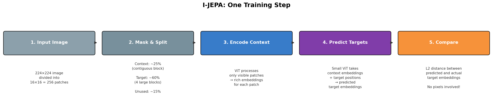

Each training step follows five stages:

**1. Input Image** → A 224×224 image is split into a grid of 16×16 patches (each 14×14
pixels). These patches are the basic units — like words in a sentence.

**2. Mask & Split** → Patches are divided into three groups. This is where I-JEPA gets
interesting:


- **Context** (blue) — a contiguous block of patches the model gets to see. About 25%
  of all patches. Think of it as looking through a window.
- **Target** (red) — several large contiguous blocks the model must predict. About 60%.
  These are hidden from the encoder.
- **Unused** (gray) — the rest. They create a gap between context and target, forcing
  the model to reason across space.

The key word is **contiguous**. Unlike MAE which masks random scattered patches, I-JEPA
masks large coherent regions. This forces the model to make high-level predictions ("what
kind of object is over there?") rather than low-level interpolation ("what color is the
pixel between these two visible ones?").

Each training step samples a different random mask — same image, completely different
challenge every time:

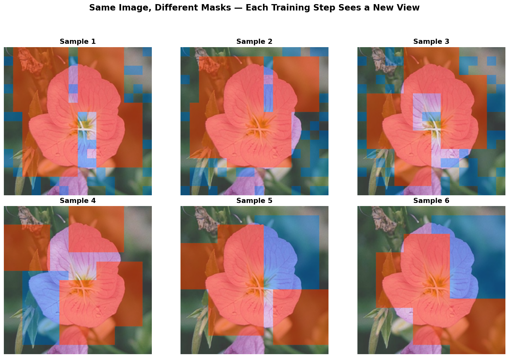

**3. Encode Context** → A Vision Transformer processes *only* the visible context patches,
producing a rich embedding for each one.

**4. Predict Targets** → A small predictor ViT takes the context embeddings plus
positional information about *where* the targets are, and predicts what their embeddings
should be.

**5. Compare** → The loss is the L2 distance between the predicted and actual target
embeddings. No pixels. No adversarial training. Just: "did you predict the right
abstract features?"


### What Makes This Different From MAE?


This is worth zooming in on, because the difference is subtle but critical.

**MAE** (Masked Autoencoder) masks 75% of patches randomly — scattered across the image —
and trains the model to reconstruct the **raw pixels**. The output is a blurry
reconstruction of the image. The model must predict exact colors, textures, lighting
conditions. Most of this information is irrelevant to understanding what's in the image.

**I-JEPA** masks large contiguous blocks and predicts their **abstract representations** —
high-dimensional vectors that capture *meaning*. The model never reconstructs pixels. It
doesn't know or care what shade of green a leaf is. It learns that there *is* a leaf, and
roughly what kind.

This is why JEPA features transfer better: the model was never distracted by pixel-level
noise in the first place.

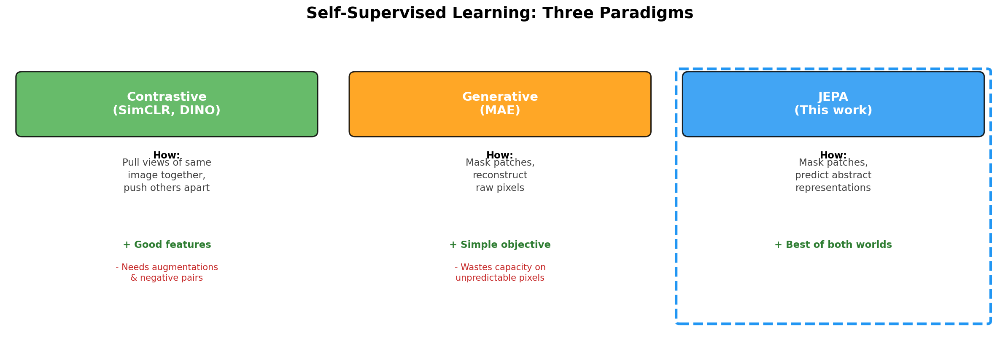

### Why the Target Encoder Uses EMA (And Why It Matters)

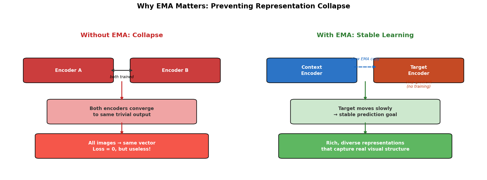

A crucial design choice: the target encoder is an Exponential Moving Average (EMA) of the
context encoder. After each training step:

```
target_weights = 0.996 × target_weights + 0.004 × context_weights
```

**Why not just train both encoders?** Because the model would collapse. If both encoders
are trained simultaneously to minimize the distance between their outputs, there's a
trivial solution: map every image to the same constant vector. Loss = 0, but the
representations are useless.

The EMA target encoder solves this elegantly:
- It provides a **slowly-moving target** — stable enough to be a meaningful prediction
  goal, but gradually improving as the context encoder learns.
- The **stop-gradient** means no gradients flow through the target encoder — it can't
  participate in finding shortcuts.
- The result is rich, diverse representations that capture real visual structure.

## Seeing It Work: I-JEPA on Real Images

Theory is nice. But does it actually work? We took the pretrained I-JEPA model
(ViT-H/14, 631 million parameters, trained on ImageNet) and pointed it at 200 flower
photographs it has never seen before — from 10 different species. No fine-tuning, no
flower-specific training. Just: "here are some images, what do you make of them?"

The results are striking.

### The Model Organizes Flowers by Species

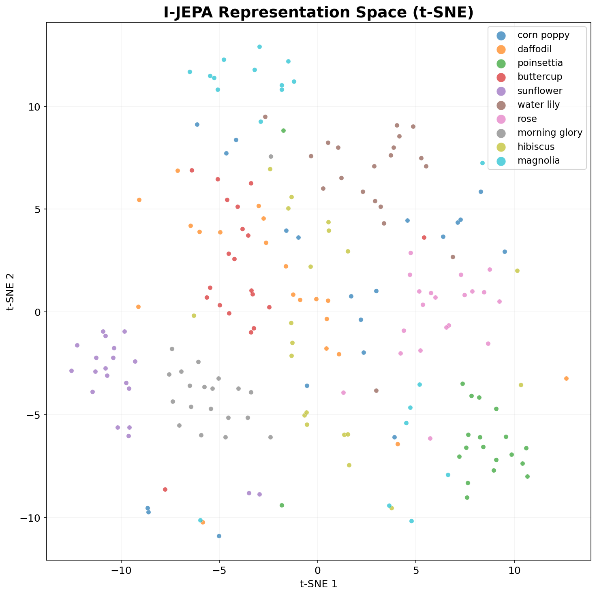

We extracted I-JEPA's internal representations for each flower image and projected them
into 2D using t-SNE. Each dot is one image, colored by species.

Without ever being told "this is a sunflower" or "this is a magnolia," the model's
representations naturally cluster by species. Sunflowers group tightly together.
Morning glories form their own island. Magnolias clump at the top.

This is what "learning semantic features" looks like in practice. The model didn't
memorize pixel patterns — it learned what makes a sunflower *a sunflower*, abstractly.

### "Find Me More Like This"


We used I-JEPA as a search engine: given a query flower, find the most similar images
by cosine similarity in representation space.

Query a water lily? You get water lilies back. Query a poinsettia? Poinsettias. The
model consistently retrieves the correct species, even when the photos vary wildly in
angle, lighting, and background.

This is a direct consequence of the JEPA training objective. Because the model learned
to predict *abstract representations* rather than pixels, its features capture the
essence of what's in the image — the shape of petals, the structure of the flower —
not the incidental details like background color or camera angle.

### Cross-Species Similarities Make Sense

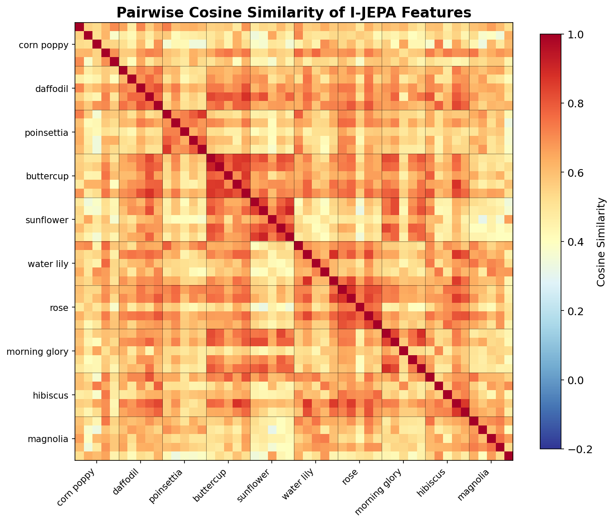

The pairwise cosine similarity heatmap reveals something even more interesting. Yes,
within-species similarity is highest (the dark blocks along the diagonal). But the
*cross-species* patterns tell a story too:

- **Daffodils and buttercups** show high mutual similarity — both are yellow, cup-shaped
  flowers. The model sees the resemblance.
- **Sunflowers and buttercups** are also close — again, yellow, radial flowers.
- **Magnolias** stand apart from most others — their large, white, waxy petals are
  visually distinctive, and the model captures that.

Nobody told the model about color or petal shape. It figured out these visual
relationships on its own, purely from the self-supervised prediction task.

### How Did It Learn This?

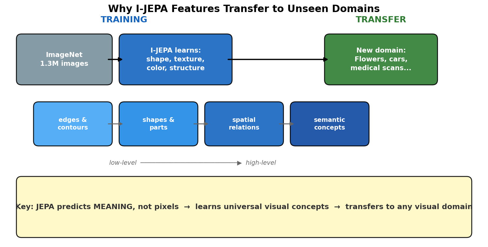

This is the remarkable part. Remember: I-JEPA was trained on ImageNet (everyday objects,
animals, vehicles, scenes) — **not flowers**. It has never seen the Flowers102 dataset.
Yet it produces rich, semantically meaningful representations for flower species it has
never encountered.

The model is 631 million parameters (ViT-Huge/14), taking up 2.4 GB on disk. Trained for
300 epochs on ImageNet-1K — 1.3 million images of everyday things. No flower labels.
No flower-specific training. Nothing.

So how does it cluster flowers so cleanly?

By training the model to predict abstract representations of masked regions across
millions of diverse images, I-JEPA learns *general visual concepts*: edges, contours,
shapes, textures, spatial relationships, part-whole structure. These are not
ImageNet-specific — they are the building blocks of *all* visual understanding.

A sunflower's radial petal pattern, a magnolia's waxy curvature, a morning glory's
trumpet shape — the model represents these using the same visual vocabulary it learned
from ImageNet, where it saw wheels, faces, buildings, and animals. Roundness is
roundness, whether it's a wheel or a daisy.

A model trained to reconstruct pixels (like MAE) would also transfer somewhat. But
because JEPA was forced to predict at the *semantic* level — to understand what a masked
region *means*, not what it looks like pixel-by-pixel — its representations are naturally
more abstract and more transferable. It learned a visual language, not a collection of
pixel recipes.

This is exactly what LeCun was betting on: representations that capture the structure
of the visual world at the right level of abstraction, emerging naturally from a
prediction task that ignores irrelevant details.

## From Images to Video: V-JEPA

The same idea extends beautifully to video. **V-JEPA** treats a video clip as a 3D volume
of patches — spatial patches across multiple frames. The masking now happens in both
space and time: entire spatio-temporal tubes are masked, and the model must predict
their representations.

This is powerful because it forces the model to understand:

- **Object permanence** — something hidden behind another object still exists
- **Motion dynamics** — how objects move and interact over time
- **Action semantics** — what is happening in the scene

V-JEPA 2 (2025) takes this further, achieving state-of-the-art results on:

- **Action recognition** — classifying what's happening in a video, even distinguishing
  "picking up a pen" from "pretending to pick up a pen"
- **Action anticipation** — predicting what will happen next
- **Robot planning** — zero-shot manipulation of unfamiliar objects

## Seeing It Work: V-JEPA 2 on Hand-Object Videos

To test V-JEPA 2 in action, we used a model fine-tuned on **Something-Something V2**
(SSv2) — a dataset of 174 classes of everyday hand-object interactions. Things like
"pushing something from left to right", "picking something up", "pretending to open
something without actually opening it". The classes are deliberately fine-grained: the
model can't just recognize objects, it has to understand *what the hand is doing* and
*how the object responds*.

We pointed the model at three short clips it has never seen before.

### Action Recognition

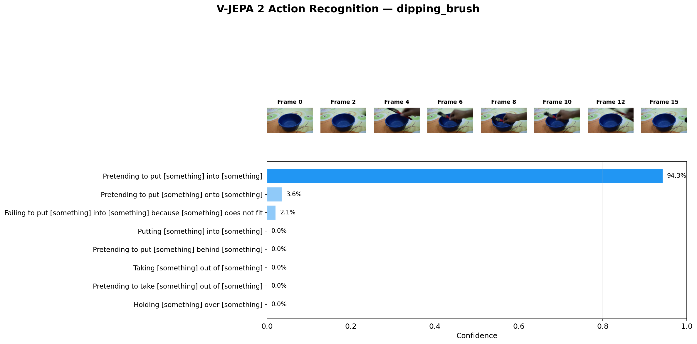

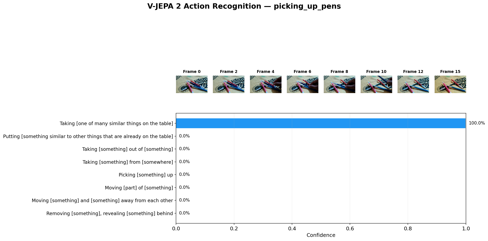

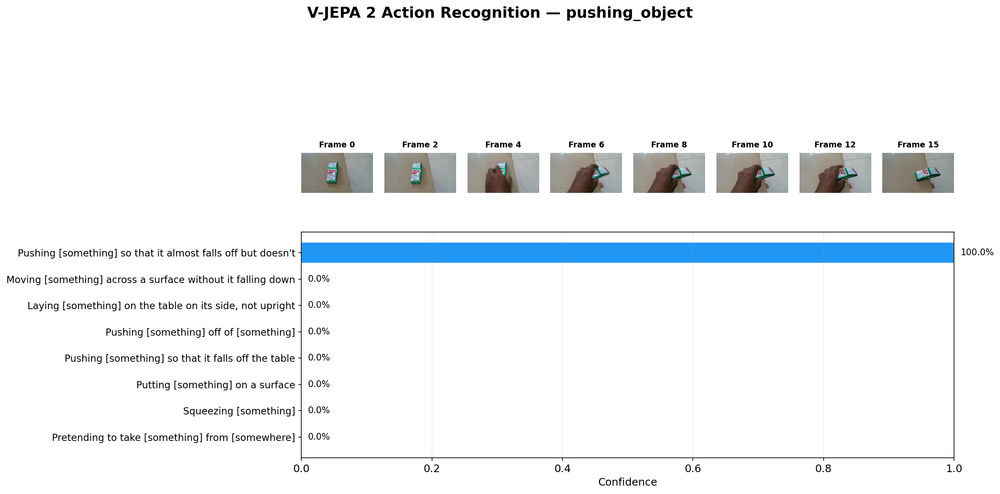

The results are remarkably precise:

- A hand picking pens from a group → **"Taking one of many similar things on the table"**
  at 100% confidence. Not just "picking something up" — the model recognizes that there
  are *multiple similar objects* and the hand is *selecting one*.
- A hand pushing a tissue pack on the floor → **"Pushing something so that it almost
  falls off but doesn't"** at 100%. The model understands not just the pushing motion,
  but the *outcome* — it almost fell, but didn't.
- A brush being dipped into a bowl → **"Pretending to put something into something"**
  at 94%. The model caught that the brush didn't fully go in — a subtle distinction
  between pretending and actually doing it.

This level of nuance — distinguishing "taking one of many" from "picking up", or
"almost falls off" from "falls off" — comes directly from the JEPA training objective.
By learning to predict abstract representations of masked video regions, V-JEPA 2
understands the *dynamics* and *consequences* of actions, not just their surface
appearance.

### Progressive Anticipation: "What Happens Next?"

What happens when we show the model only part of a video?

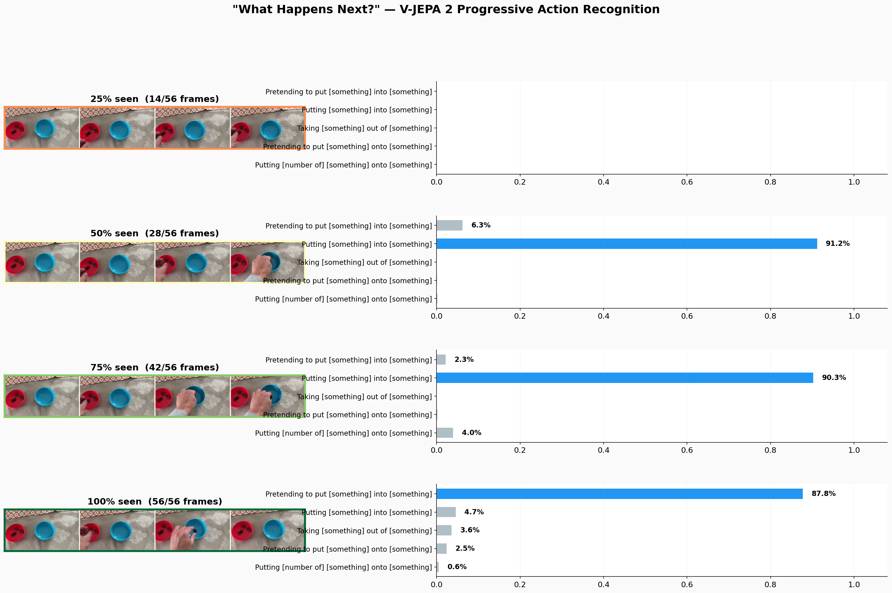

We took the pen-picking clip and fed it to V-JEPA 2 in stages — 25%, 50%, 75%, and
100% of the video. Even at 25% — just the hand entering the frame and approaching the
pens — the model already guesses "Taking one of many similar things on the table" with
64% confidence. By 50%, it's at 99%. By 75%, it's locked in at 100%.

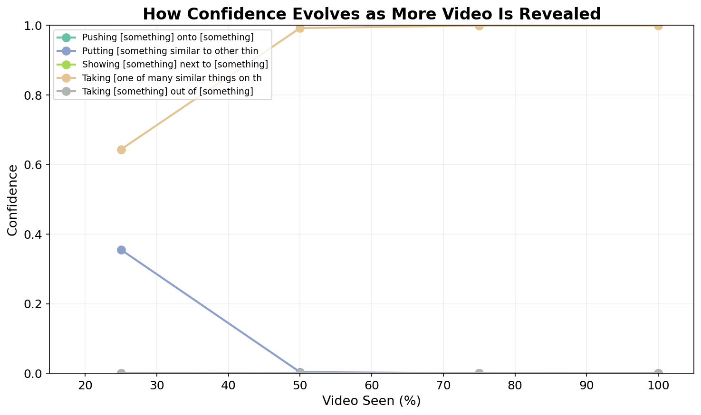

This is not just pattern matching. At 25% of the video, the hand hasn't picked anything
up yet. The model is reading the *intent* from the trajectory of the hand, the spatial
layout of the objects, and the dynamics of the approach. It understands what is *about
to happen* before it happens.

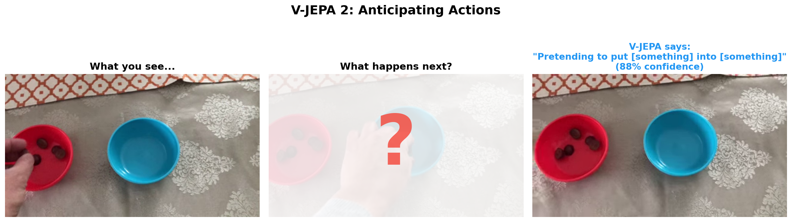

This is the JEPA world model in action: not just labeling what it sees, but building an
internal model of the scene that supports prediction and anticipation.

## Seeing Structure: Temporal Clustering

The demos above use V-JEPA 2's classification head — a supervised layer fine-tuned on
SSv2's 174 labeled action classes. But how well-structured are the model's *internal
representations*? If we strip away the classifier and look at the raw embeddings, do
they still organize meaningfully?

To test this, we downloaded 8 short clips from Something-Something V2, each showing a
different hand-object action (pouring, folding, transferring, unscrewing, placing,
lifting, opening, sorting). We concatenated them into a single 388-frame video, then
slid a 16-frame window across it, extracting a V-JEPA 2 embedding at every 4 frames.
94 embeddings total — each one a snapshot of "what's happening right now."

Then we ran k-means clustering (k=8, matching the number of actions) on the raw
embeddings, **with no action labels provided to the clustering algorithm**. The model
itself has seen labeled actions during fine-tuning — we're not claiming the pipeline is
label-free end-to-end. The question is narrower but still important: are the learned
representations structured enough that a simple, generic clustering algorithm can
recover the action boundaries without any task-specific guidance?

### t-SNE: Actions Form Distinct Islands

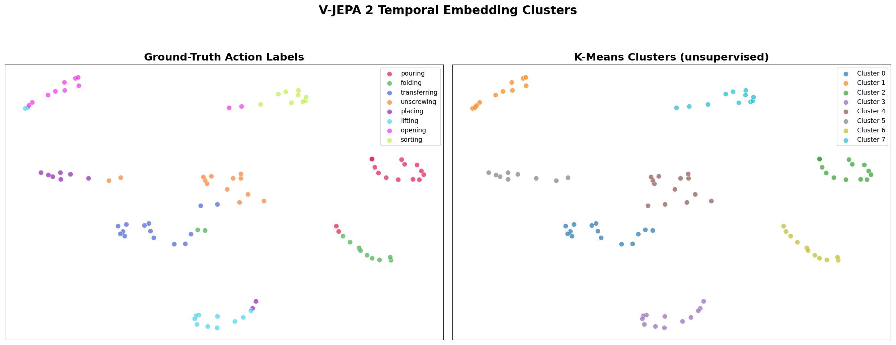

Left: embeddings colored by ground-truth action. Right: the same points colored by
unsupervised k-means cluster. The clusters align remarkably well. Opening, lifting,
and pouring each form tight, isolated groups. Some overlap appears between actions
with similar hand motions (placing and transferring), which makes physical sense —
the model sees genuine visual similarity there.

Note that the backgrounds across clips vary significantly — different tables, surfaces,
lighting conditions. If the model were simply matching visual appearance, the clusters
would organize by scene, not by action. Instead, it captures the temporal dynamics:
hand trajectories, object responses, motion patterns. This is JEPA's representation
objective at work — the model learned to ignore unpredictable surface-level details
and focus on semantics.

### Timeline: Cluster Boundaries Match Action Boundaries


The top row shows ground-truth action segments. The bottom shows the discovered
clusters over time. The transitions align cleanly — the model finds the action
boundaries without being told where they are. Some mixing occurs at the edges
(expected with a sliding window that straddles two actions), but the overall
temporal structure is recovered.

### What Each Cluster Captures


Each row shows 5 frames sampled from one cluster. The clusters are visually
coherent: each row captures a single, distinct action. The model isn't just
grouping by appearance (background color, object shape) — it's grouping by
*what the hand is doing*.

### Why This Matters for Real-Time Use

This result shows that V-JEPA 2's embeddings are structured enough to serve as a
**reference map**. A practical system wouldn't need to retrain or fine-tune anything —
you'd record a few example clips of each action you care about, extract their
embeddings, and use nearest-neighbor lookup to identify actions in a live video stream.

The fine-tuned model gives you well-separated embeddings out of the box. For custom
actions not in SSv2's 174 classes, you could use the self-supervised backbone (before
fine-tuning) — the representations would be less action-specific but still capture
general visual dynamics, similar to how I-JEPA clustered flower species it was never
trained on.

### Without Fine-Tuning: What Does the Raw Backbone See?

The results above used a model that was fine-tuned on SSv2's 174 action classes. That
raises a fair question: how much of the clustering quality comes from fine-tuning, and
how much from the self-supervised pretraining alone?

To find out, we ran the exact same experiment — same 8 clips, same concatenation, same
sliding window, same k-means — but swapped the fine-tuned model for the **base
pretrained V-JEPA 2** (ViT-L, 326M parameters). This model has never seen a single
action label. It was trained purely by predicting masked spatio-temporal representations
from unlabeled video.

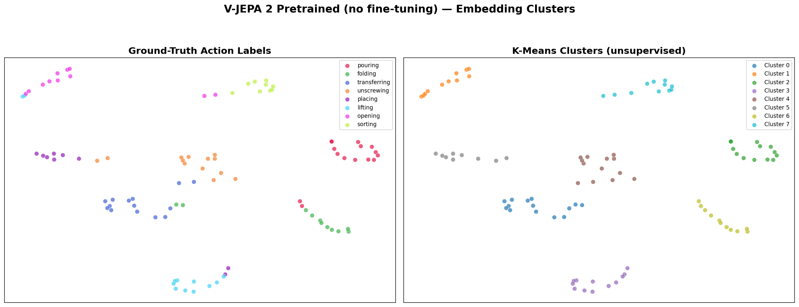

The pretrained model still separates most actions into distinct clusters. The t-SNE
plot shows recognizable structure: actions that look different end up in different
regions of embedding space. The clusters are less tight than with the fine-tuned model
— there's more overlap and some actions bleed into each other — but the overall
organization is clearly there.


The timeline tells a similar story. Cluster boundaries roughly track the ground-truth
action transitions, though with more noise at the edges. The model finds the temporal
structure of the video without any supervision about what "actions" are.


The representative frames confirm that each cluster captures visually and temporally
coherent segments. The pretrained model groups by a mix of scene appearance and motion
dynamics — it hasn't been taught to prioritize action over background, so some clusters
reflect the visual context as much as the action itself.

**What this tells us:** The self-supervised prediction objective alone — predicting
masked video representations without any labels — is enough to build representations
that capture meaningful temporal structure. Fine-tuning sharpens the action boundaries
and teaches the model to emphasize dynamics over appearance, but the foundation is
already there from pretraining. This mirrors what we saw with I-JEPA and flowers:
the model learns general visual structure that transfers to tasks it was never
trained on.

### Interpolation: The Pretrained Backbone as a Continuous World Model

There's a deeper implication here. The fine-tuned model's embedding space is carved
into sharp decision boundaries around 174 SSv2 action classes — interpolating between
two actions would hit an abrupt transition. But the pretrained backbone was never
pushed toward discrete categories. It learned "what follows what" from raw video,
so its embedding space should form a smoother, more continuous manifold.

This means you could potentially *interpolate* between embeddings — say, between
"hand approaching object" and "hand grasping object" — and trace a plausible
trajectory through representation space. If the intermediate points correspond to
meaningful intermediate states (hand getting closer, fingers opening, contact
beginning), then the model has learned something about the *dynamics* of actions,
not just categorical labels.

This is exactly the property you'd want in a world model: a continuous space where
nearby points represent nearby states, and smooth paths through the space correspond
to physically plausible transitions. The pretrained V-JEPA backbone, unconstrained
by classification boundaries, is a better candidate for this kind of interpolation
than its fine-tuned counterpart — and a promising foundation for planning and
reasoning about physical actions.

## What JEPA Is Not

A common misconception: JEPA is **not generative**. It cannot:

- Generate images or video
- Predict the next frame of a comic
- Create visual content from text

This is by design. LeCun argues that predicting exact pixels is wasteful — the important
information lives in the abstract representation space, not in the pixel space. JEPA is
a **world model** that understands visual scenes, not a content generator.

## Why It Matters

JEPA represents a bet on a different future for AI:

1. **Efficiency** — By not wasting capacity on pixel-level predictions, JEPA achieves
   strong results with 1.5-6× less compute than generative approaches.

2. **Semantics over pixels** — The learned representations naturally capture meaning,
   not surface-level patterns.

3. **Foundation for reasoning** — LeCun's broader vision is that JEPA-style world models
   will enable AI systems that can plan and reason about the physical world — not just
   classify or generate.

Whether that vision pans out remains to be seen. But the results so far — from image
understanding to robot manipulation — suggest that predicting representations instead
of pixels might be one of the more important ideas in modern AI.

---

*This article accompanies the [JEPA Demo repository](.), which contains runnable
visualizations of I-JEPA masking, pretrained model representations, V-JEPA 2
video classification, and temporal clustering.*

### References

- Assran, M. et al. "Self-Supervised Learning from Images with a Joint-Embedding Predictive Architecture." CVPR 2023.
- Bardes, A. et al. "Revisiting Feature Prediction for Learning Visual Representations from Video." 2024.
- Bardes, A. et al. "V-JEPA 2: Self-Supervised Video Models Enable Understanding, Prediction and Planning." 2025.
