# JEPA FAQ — The Deep Reference

A companion document for anyone who wants to go deeper after the podcast.
Quick answers with visuals, from "what is JEPA" all the way to production and physics.

---

## The Basics

### What is JEPA?

**Joint Embedding Predictive Architecture.** A self-supervised learning method by Yann LeCun and Meta AI. The core idea: instead of predicting pixels (like image generators) or the next token (like ChatGPT), JEPA predicts *abstract representations* — compressed, high-level descriptions of what's in an image or video.

Think of it this way:
- **LLMs** predict the next *word*
- **Image generators** (MAE, diffusion) predict *pixels*
- **JEPA** predicts *meaning*

There's a whole family:
- **I-JEPA** — for images (2023)
- **V-JEPA / V-JEPA 2** — for video (2024/2025)
- **VL-JEPA** — for video + language (2025)
- **V-JEPA 2.1** — dense features, precise enough for robotics (2026)

### How is JEPA different from LLMs?

LLMs (GPT, Claude, etc.) work in *token space* — they predict the next word/token in a sequence. This works brilliantly for text because language is discrete and sequential.

But images and video aren't tokens. A 224×224 image has 150,528 pixel values. Predicting the exact shade of every pixel is:
1. **Computationally wasteful** — most pixel detail is noise (lighting, texture, compression artifacts)
2. **Semantically meaningless** — knowing the RGB value of a grass pixel tells you nothing about what's in the image

JEPA skips the pixel level entirely. It encodes images into an abstract *representation space* where a cat is "a cat" — not a specific arrangement of brown/orange/white pixels.

| | LLM | JEPA |
|---|---|---|
| **Input** | Text tokens | Image/video patches |
| **Predicts** | Next token | Representation of masked region |
| **Output** | Text generation | Visual understanding |
| **Goal** | Language generation & reasoning | Visual world model |

They're complementary, not competing. LLMs handle language; JEPA handles vision.

### How is JEPA different from CLIP?

Both CLIP and JEPA work with visual representations, but they learn in fundamentally different ways:

**CLIP** (OpenAI, 2021) uses **contrastive learning**: show it an image and a text, and it learns "do these match?" Trained on 400M image-text pairs, it pulls matching pairs together and pushes non-matching pairs apart. Result: a shared space where "photo of a cat" and a cat image land near each other. Great at matching and retrieval, but it only learns to *compare* — it doesn't deeply model what's happening in a scene.

**JEPA** uses **predictive learning**: hide part of the input and predict the representation of the missing part. No text needed, no pairs needed — just the visual input itself. This forces the model to build an internal model of how the visual world works, not just what goes with what.

| | CLIP | JEPA |
|---|---|---|
| **Training signal** | Image-text pairs (contrastive) | Self-supervised (predictive, no labels) |
| **Learns from** | 400M image-text pairs from the internet | Images/video alone |
| **Strength** | Matching vision ↔ language | Deep visual understanding |
| **Weakness** | Shallow scene understanding, needs paired data | No language (until VL-JEPA) |

**VL-JEPA** (Chen et al., 2025) bridges this gap: it applies the JEPA philosophy to language, predicting continuous text embeddings instead of generating tokens. It beats CLIP and SigLIP2 on video benchmarks with 50% fewer parameters.

Think of it this way: CLIP is *flashcards* — "does this picture go with this word?" JEPA is *fill-in-the-blank* — "given what you can see, what's missing?" The second approach builds deeper understanding.

### What does "representation space" mean?

When JEPA processes an image, it converts it into a vector — a list of ~1024 numbers. This vector captures the *essence* of the image: what objects are in it, their spatial relationships, the overall scene.

Images that are semantically similar end up with similar vectors — close together in this high-dimensional space. That's what "representation space" means.

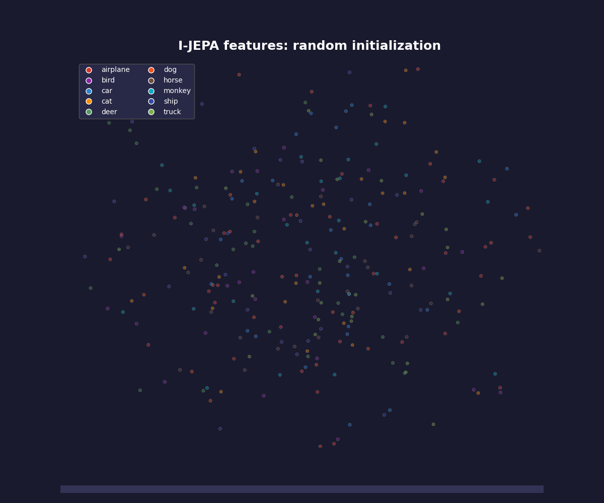

Here's a visualization: 300 images (cats, dogs, airplanes, trucks, ships) projected from representation space into 2D. The model has **never seen labels**. Yet animals cluster on one side, vehicles on the other. Cats near dogs, trucks near cars.

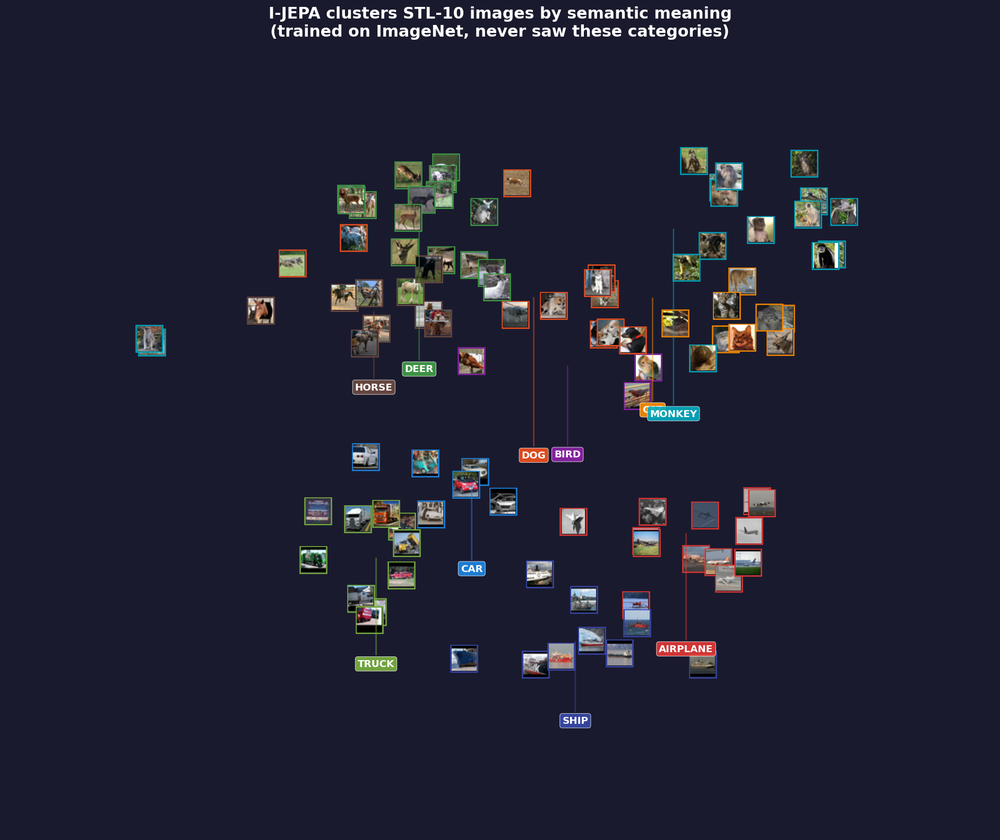

Same thing with thumbnails — you can see that horses are together, ships are together, cars are together. The model built an internal "dictionary" of visual concepts without anyone teaching it the words.

### JEPA is not a generative model — what does that mean?

JEPA **cannot**:
- Generate images or video
- Create visual content from text prompts
- Produce "deepfakes" or synthetic media

This is by design. LeCun argues that predicting exact pixels is wasteful — the important information lives in representation space, not pixel space. JEPA is a **world model** that *understands* visual scenes, not a content generator.

---

## How It Works

### What is masking and why do they do it?

Masking is a **fill-in-the-blank exercise for images** that happens **only during training**. You hide parts of the picture and make the model guess what's missing. If it can guess correctly, it must have learned something about how the visual world works.

Think of learning a language. If I give you: *"The cat sat on the ___"*, you can fill in "mat" or "chair" because you understand English. Nobody had to label the sentence for you — the structure itself was the teacher.

Same idea for images: hide patches, predict what's missing, and through millions of these exercises the model builds an understanding of visual structure. No human labels needed. That's what makes it *self-supervised*.

Once trained, the masking is gone — you feed the model a complete image or video and it just processes it normally, using everything it learned from those exercises. Like a student who practiced fill-in-the-blank but now reads and understands complete sentences.

**Why MAE and JEPA mask differently:**

- **MAE hides random scattered patches.** Most neighbors are still visible, so the model can "cheat" — just blend nearby colors and textures. It learns to interpolate pixels, but not necessarily to *understand* the image.
- **JEPA hides entire large blocks.** If the whole bottom-right of the image is gone, you can't interpolate. You have to actually reason: "I see a dog's head up here, so there's probably a dog's body down there." That forces the model to learn *concepts*, not just textures.

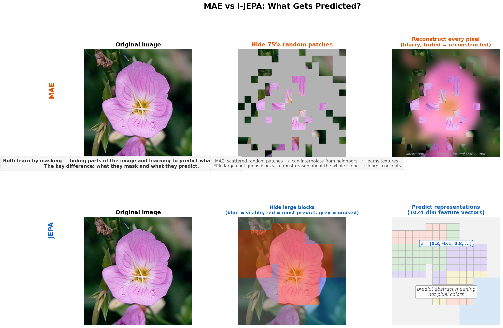

### The architecture in one picture

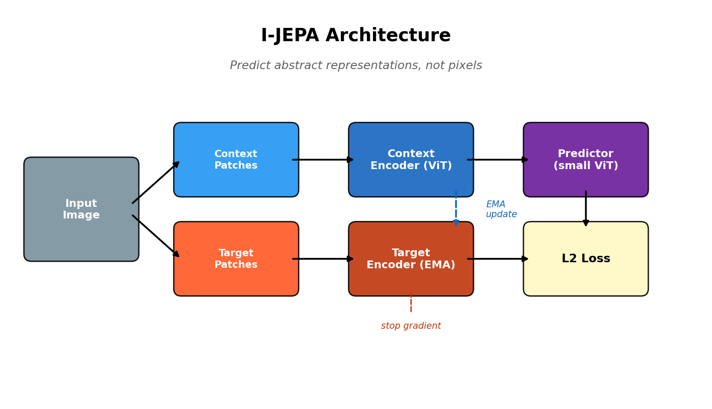

1. Take an image, split it into a grid of patches (like tiles)
2. Show the model only some patches (**context**), hide others (**targets**)
3. The **context encoder** (a Vision Transformer) processes the visible patches
4. A small **predictor** network tries to predict the *representations* of the hidden patches
5. The **target encoder** (a slowly-updated copy of the context encoder) provides the "correct answer"
6. The loss is: how close were the predicted representations to the actual ones?

No pixels are ever reconstructed. The entire game happens in representation space.

### Why does JEPA mask large blocks instead of random patches?

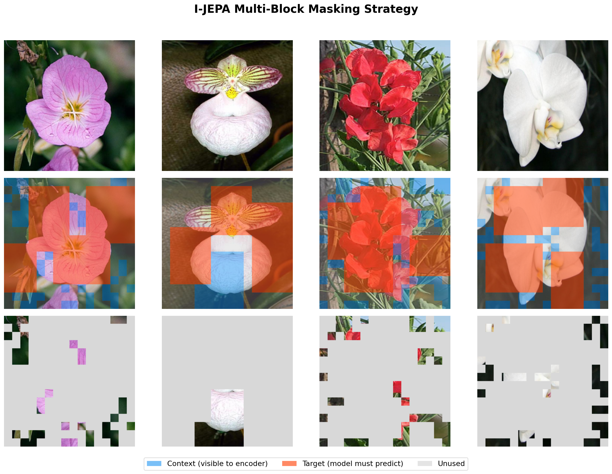

MAE (the pixel-prediction approach) masks random patches scattered across the image. This lets the model "cheat" by interpolating from nearby visible pixels — filling in texture without understanding what's there.

JEPA masks **large contiguous blocks**. This forces high-level reasoning: "Given that I can see a dog's head in the upper-left, what kind of thing should be in the lower-right?" The answer requires understanding the whole scene, not just local texture.

### What's the difference between pixel prediction and representation prediction?


**Left (MAE):** Hide patches → reconstruct exact pixels. Result: blurry, wastes capacity on irrelevant detail.

**Right (JEPA):** Hide patches → predict abstract features. Result: model focuses on meaning.

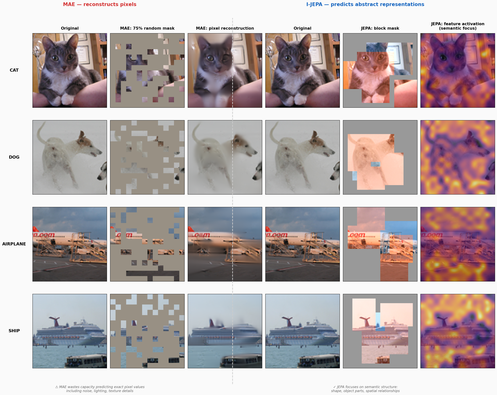

Same four images — cat, dog, airplane, ship. MAE's pixel reconstruction is blurry. JEPA's feature activation map lights up on the *meaningful* parts: the cat's face, the airplane's shape. It ignores background noise.

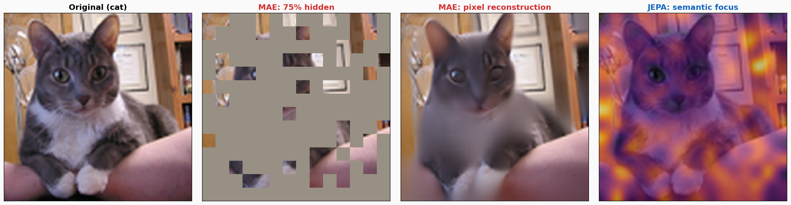

Zoomed in: MAE wastes enormous capacity predicting fur texture and lighting. JEPA doesn't care about fur — it knows it's a cat.

### How does JEPA avoid collapse? (The EMA trick)

The biggest danger: both encoders could learn to output the same constant vector for every image. Loss = 0, but completely useless.

**Solution:** The target encoder is an **Exponential Moving Average** of the context encoder:

```
target_weights = 0.996 × target_weights + 0.004 × context_weights
```

Plus a **stop-gradient**: no backpropagation flows through the target encoder. It can't participate in finding shortcuts.

The target encoder moves slowly, giving the predictor a stable but gradually improving target. Too fast → collapse. Too slow → frozen useless targets. The 0.996 rate is the sweet spot.

No negative samples needed (unlike contrastive methods like SimCLR). The architecture itself prevents collapse.

---

## What Can It Do?

### Image understanding — without any labels

I-JEPA (trained on ImageNet everyday objects) was applied to datasets it has **never seen**:

**Flowers:** 200 flower photos from 10 species. No flower-specific training. Result: clean clusters by species. Sunflowers with sunflowers, magnolias with magnolias. Even cross-species similarities make sense — daffodils near buttercups (both yellow and cup-shaped).


**STL-10:** 300 images across 10 categories (the t-SNE animation above). Clean separation between animals and vehicles, with sub-clusters for each category.

The model learns *general visual concepts* — edges, shapes, spatial relationships — that transfer to anything visual.

### Video action recognition

V-JEPA 2 understands **what's happening** in video, not just what objects are present.

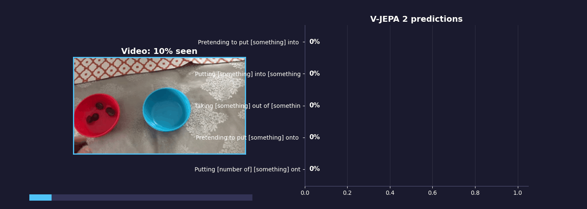

The model watches a video and classifies actions in real time. Fine-tuned on Something-Something V2 (174 classes of hand-object interactions), it distinguishes incredibly subtle differences:

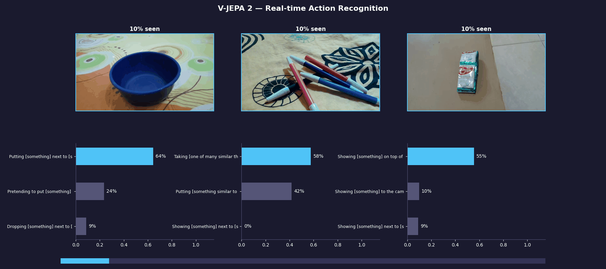

- "Taking one of many similar things" (not just "picking up")
- "Pushing something so it almost falls off but doesn't" (not just "pushing")
- "Pretending to put something into something" (caught the fake!)

### Can it predict what happens next?

Yes. V-JEPA 2 predicts *outcomes* before they happen.

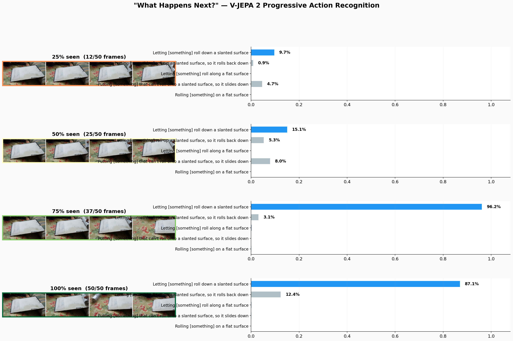

**Rolling prediction:** At 75% of the video, the object hasn't finished rolling, but the model is already 96% confident: "Letting something roll down a slanted surface."

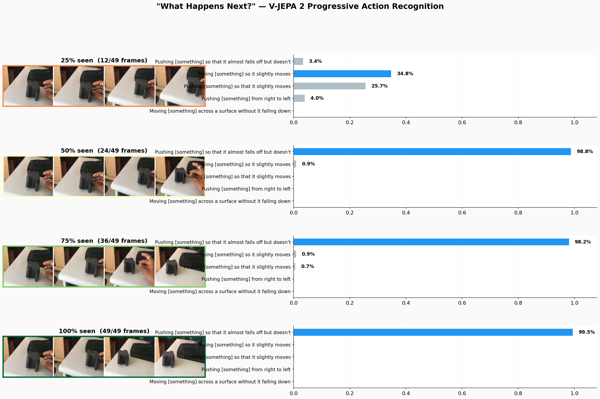

**Near-miss:** At 50%, the model is 99% sure the object *almost* falls off but doesn't. Not "falls off" — "*almost* falls off." It predicted the near-miss halfway through.

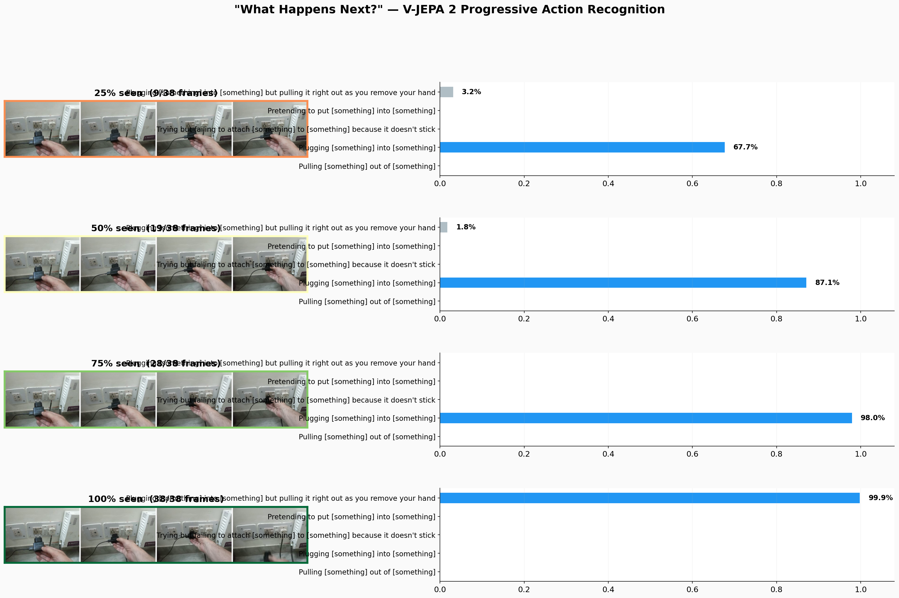

**Last-second reversal:** For 75% of the video, the model says "Plugging something in" with rising confidence (up to 98%). Then at 100%, it sees the hand pull back and flips to "Plugging something in but pulling it right out" at 99.9%.

### Can it discover actions without labels?

Yes — V-JEPA 2's representations are structured enough for unsupervised clustering to find action boundaries.

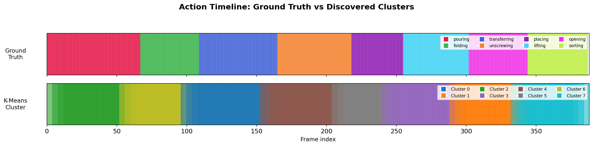

We concatenated 8 different action videos and ran k-means clustering on the raw embeddings. No labels. The discovered cluster boundaries align with the actual action transitions.


Watch the dot jump between regions of representation space every time the action changes. Pouring lives in one region, folding in another, unscrewing in a third. The model organized all of this on its own.

Even the **pretrained model** (no fine-tuning, no labels at all) finds this structure:

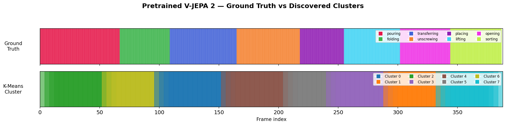

### The playground experiment: real vs pretend


We tested V-JEPA 2 on a real scenario: same hand, same toy, same background. In one video: actually putting a ball into a bag. In the other: *pretending* to — same motion, but not letting go.

To a pixel-prediction model, these look almost identical. But V-JEPA sees through the fake — because in representation space, the *outcome* matters, not just the motion.

The model also segments a 60-second continuous playground video into actions in real time, with no prompting or tricks.

---

## Production & Practical Use

### Is V-JEPA 2 production ready?

**The short answer:** The model is research-grade, open-weight, and runs inference even on CPU. It's usable today for prototyping and specific applications, but it's not a drop-in enterprise product.

**What's ready:**
- Open weights from Meta (via PyTorch Hub / HuggingFace)
- Runs on CPU for inference — we ran all demos on CPU, no GPU needed
- Fine-tuned models available for Something-Something V2 (174 hand-object action classes)
- The pretrained backbone can be used as a feature extractor for custom tasks without fine-tuning
- Classification of short video clips is feasible even without a GPU

**What you'd need to build:**
- A pipeline around it: video ingestion, windowing, post-processing
- Fine-tuning on your specific domain if the SSv2 classes don't cover it
- Batching and optimization for high-throughput production use
- Integration with your existing systems

**What's not there yet:**
- No official production API or managed service
- No built-in streaming / real-time video pipeline
- Limited to the action vocabulary it was trained/fine-tuned on (unless you use the pretrained backbone as a general feature extractor)

### What hardware do I need?

For **inference** (running the model on new videos):
- **CPU is enough** — we ran every demo in this project on CPU, no GPU required
- The ViT-L model (326M parameters) is the most practical size
- For **real-time** use (live video streams), a GPU would be needed

For **fine-tuning** on your own data:
- GPU resources are needed (multiple GPUs recommended)
- Something-Something V2 fine-tuning was done on 16+ GPUs by Meta

For **just using the features** (extract embeddings, do nearest-neighbor lookup):
- CPU to extract features, then everything else is trivial
- This is the most practical production path today

### How would I use this for my own videos / actions?

**Option 1 — Use the fine-tuned model directly:**
If your actions overlap with the 174 Something-Something V2 classes (hand-object interactions), you can use the fine-tuned model out of the box. Point it at your video, get predictions.

**Option 2 — Use the pretrained backbone as a feature extractor:**
Record a few example clips of each action you care about. Extract V-JEPA embeddings. At inference time, extract the embedding of the new video and do nearest-neighbor lookup against your examples. No fine-tuning needed — this is the "reference map" approach.

**Option 3 — Fine-tune on your domain:**
Collect labeled data for your specific actions, fine-tune V-JEPA 2 on it. This gives the best results but requires more data and compute.

Our demo scripts (`demos/11_your_own_video.py`, `demos/12_your_own_latent_space.py`) show how to get started with options 1 and 2.

### What about real-time / streaming video?

V-JEPA 2 processes fixed-length clips (typically 16 frames). For continuous video, you slide a window across the stream and classify each window. Our `classify_sliding.py` script does exactly this — it's how we made the playground demo.

This isn't true frame-by-frame streaming, but for most practical applications (security, manufacturing QA, activity monitoring), the sliding window approach works well. We ran it on CPU for our demos; for real-time production use, a GPU would bring the latency down significantly.

### What datasets was it trained on?

- **I-JEPA:** ImageNet-1K (1.3M images, 1000 everyday object categories)
- **V-JEPA 2 pretraining:** VideoMix2M (2M video clips from multiple sources, no labels)
- **V-JEPA 2 fine-tuning:** Something-Something V2 (220K short videos, 174 hand-object interaction classes), Kinetics-400 (240K videos, 400 action classes), and others

The key insight: pretraining is *self-supervised* (no labels). You only need labels for fine-tuning, and even without fine-tuning the features are remarkably useful.

---

## Deep Theory

### What's the connection to energy-based models?

JEPA is explicitly built on LeCun's **energy-based model** framework. The math is borrowed directly from statistical mechanics:

- An **energy function** E(x, y) — low energy for compatible input-output pairs, high for incompatible
- The **Gibbs-Boltzmann distribution** to convert energy to probability: P(Y|X) = e^(-βE) / Z
- **β** is an inverse temperature
- **Z** is the partition function

This isn't a loose metaphor. LeCun presented this framework at the **Les Houches Summer School on Statistical Physics and Machine Learning** (2022), and the resulting lecture notes were published in the *Journal of Statistical Mechanics*.

The collapse problem (model outputs constant vectors) is a **flat potential** — no structure, no wells, no barriers. The EMA target encoder is the solution: a slowly-evolving potential that prevents collapse while allowing learning.

### How does JEPA relate to renormalization in physics?

JEPA's encoder performs something structurally similar to **Wilsonian renormalization** — integrating out fine-grained details to get an effective description at a coarser scale:

| Renormalization Group | JEPA Encoder |
|---|---|
| Integrate out short-wavelength modes | Discard pixel-level detail |
| Retain long-range correlations | Retain semantic structure |
| Effective theory at coarser scale | Latent representation |
| Universality: different microscopics → same macroscopics | Transfer: different images → same representation for same concept |

Mehta & Schwab (2014) showed this connection is mathematically grounded, not just analogy: restricted Boltzmann machines on Ising model configurations implement a mapping exactly equivalent to a variational RG scheme.

### Why is predicting in latent space fundamentally better?

Consider predicting the next frame of a ball rolling. A physicist needs: position, velocity, forces. That's it.

A pixel-prediction model needs: position, velocity, forces, *plus* the exact lighting, shadow gradients, background texture, camera jitter, JPEG compression... The ball's trajectory is deterministic, but the *pixels* are not. Irrelevant degrees of freedom contaminate the prediction.

JEPA resolves this by predicting in a learned space where irrelevant degrees of freedom have been **integrated out**. The ball's position and velocity are retained. The shadow and compression artifacts are gone.

This is the same principle that makes generalized coordinates more powerful than Cartesian coordinates for constrained systems in classical mechanics. By choosing the right variables, constraints become invisible and dynamics become simple. JEPA *learns* those variables from data.

### What's the connection to loss surfaces and spin glasses?

LeCun co-authored work mapping neural network loss functions to the **Hamiltonian of a spherical spin-glass model** (Choromanska et al., 2015). Using random matrix theory, they showed that for large networks, local minima concentrate near the global minimum — explaining why gradient descent works despite the non-convex landscape.

The follow-up (Chaudhari, LeCun et al., 2017) used **Langevin dynamics** to bias optimization toward wide, flat minima — computing a local entropy to favor robust solutions. This is genuine statistical physics applied to deep learning.

### Where is this going? World models.

LeCun's end goal isn't classification or recognition. It's **world models** — AI systems with an internal model of how the physical world works, enabling planning and reasoning.

From his 2022 paper "A Path Towards Autonomous Machine Intelligence": "many types of reasoning can be viewed as forms of energy minimization" and a value "that defies the laws of physics should result in a high energy value."

JEPA is the representation-learning foundation: learn the right state space. V-JEPA 2 begins addressing the next step: learning dynamics within that space, demonstrated through zero-shot robot planning and intuitive physics benchmarks.

---

## References

**JEPA papers:**
- Assran, M. et al. "Self-Supervised Learning from Images with a Joint-Embedding Predictive Architecture." CVPR 2023.
- Bardes, A. et al. "Revisiting Feature Prediction for Learning Visual Representations from Video." 2024.
- Bardes, A. et al. "V-JEPA 2: Self-Supervised Video Models Enable Understanding, Prediction and Planning." 2025.

**LeCun's energy-based framework:**
- LeCun, Y., Chopra, S. & Hadsell, R. "A Tutorial on Energy-Based Learning." MIT Press, 2006.
- Dawid, A. & LeCun, Y. "Introduction to Latent Variable Energy-Based Models." *J. Stat. Mech.* 2024.
- LeCun, Y. "A Path Towards Autonomous Machine Intelligence." 2022.

**Physics connections:**
- Choromanska, A. et al. "The Loss Surfaces of Multilayer Networks." AISTATS 2015.
- Chaudhari, P. et al. "Entropy-SGD: Biasing Gradient Descent Into Wide Valleys." ICLR 2017.
- Mehta, P. & Schwab, D. J. "An exact mapping between the Variational Renormalization Group and Deep Learning." 2014.
